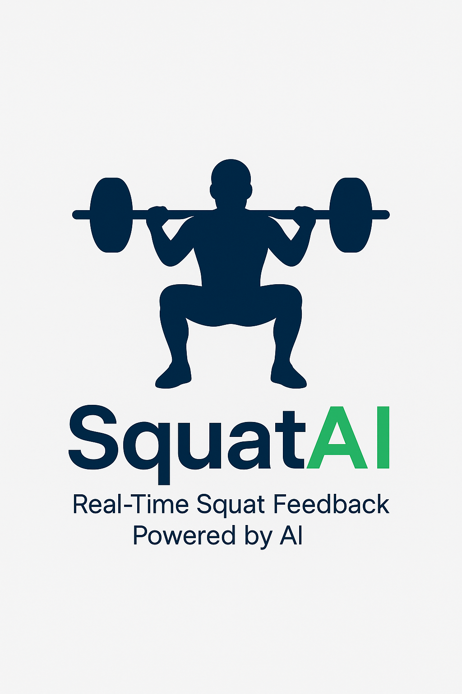

<p align="center">
  
</p>

# 🏋️ Real-Time Squat Analysis Tool (YOLOv8 + PyQt5)

This project provides a real-time squat form analyser that uses **YOLOv8 pose estimation** inside a **PyQt5 GUI**.  
It measures **knee angle** and **torso angle**, gives a traffic-light depth cue, counts reps, and plays an audio beep for every valid squat.

---

## 📸 Features

- **Real-time pose** (17 COCO key-points) via YOLOv8.
- **Metrics**
  - Knee angle (hip – knee – ankle)
  - Torso angle (shoulder – hip vs vertical)
- **Traffic light feedback**
  - 🟢 ≤ 90 °   (legal depth)
  - 🟠 91 – 110 ° (approaching)
  - 🔴 > 110 °   (not deep enough)
- **Rep counter** with audio beep.
- **Clean GUI** (Start / Stop, live feed, overlays, running totals).

---

## 💡 Best Results

> **Place the camera side-on to the athlete.**  
> A lateral view captures knee flexion and torso angle most accurately in 2-D.

---

## 🚀 Getting Started

### 1  Clone the repository
```bash
git clone https://github.com/El3ctricR/squat_tracker_awrc_demo.git
cd squat_tracker_awrc_demo
```

---

### 2  Install dependencies
> Requires **Python 3.8 +**. A CUDA-capable GPU is recommended for 30 FPS+.

```bash
pip install -r requirements.txt
```

<details>
<summary>If you prefer manual installation, expand for commands</summary>

```bash
pip install ultralytics==8.0.20
pip install opencv-python
pip install numpy
pip install PyQt5
```
</details>

*Ensure your PyTorch/CUDA versions match your GPU setup — see the
[Pytorch install guide](https://pytorch.org/get-started/locally).*

---

## 🧰 Usage
```bash
python squat_gui_app.py
```
* In the GUI click **Start** to begin analysis.  
* Click **Stop** to end the session.

During a session you will see:
- Live webcam feed.
- Knee / Torso angles (°).
- Traffic-light depth icon.
- Running rep counter with a beep for each valid squat.

---

## 📁 File Structure
```
├── squat_gui_app.py        # Main application (GUI + analysis)
├── yolov8n-pose.pt         # YOLOv8 pose model (download separately if absent)
├── requirements.txt        # Python dependencies
└── README.md               # This documentation
```

---

## 📄 License

Released under the **MIT License**.  
See the included `LICENSE` file for full terms.

---

## 🙏 Acknowledgements

- 🤖 [Ultralytics / YOLOv8](https://github.com/ultralytics/ultralytics) – pose estimation backbone  
- 🖼️ [OpenCV](https://opencv.org/) – real-time computer vision  
- 💻 [PyQt5](https://pypi.org/project/PyQt5/) – GUI framework  
- 🔉 Windows `winsound` module – audio feedback for reps  

---

## 📝 Notes & Troubleshooting

| Topic | Tip |
|-------|-----|
| **Audio on macOS/Linux** | Replace `winsound.Beep()` with `playsound` or `pygame.mixer.Sound`. |
| **Model download** | If `yolov8n-pose.pt` is missing, download it from the Ultralytics repo or run:<br>`from ultralytics import YOLO; YOLO('yolov8n-pose.pt')`. |
| **Performance** | `yolov8n-pose.pt` offers ~30 FPS on an RTX 3060. Larger models improve accuracy at the cost of speed. |
| **Camera view** | Keep the athlete fully in frame and perpendicular to the camera plane for the most reliable depth detection. |

---

Happy squatting! Feel free to open issues or PRs if you improve the tool.

